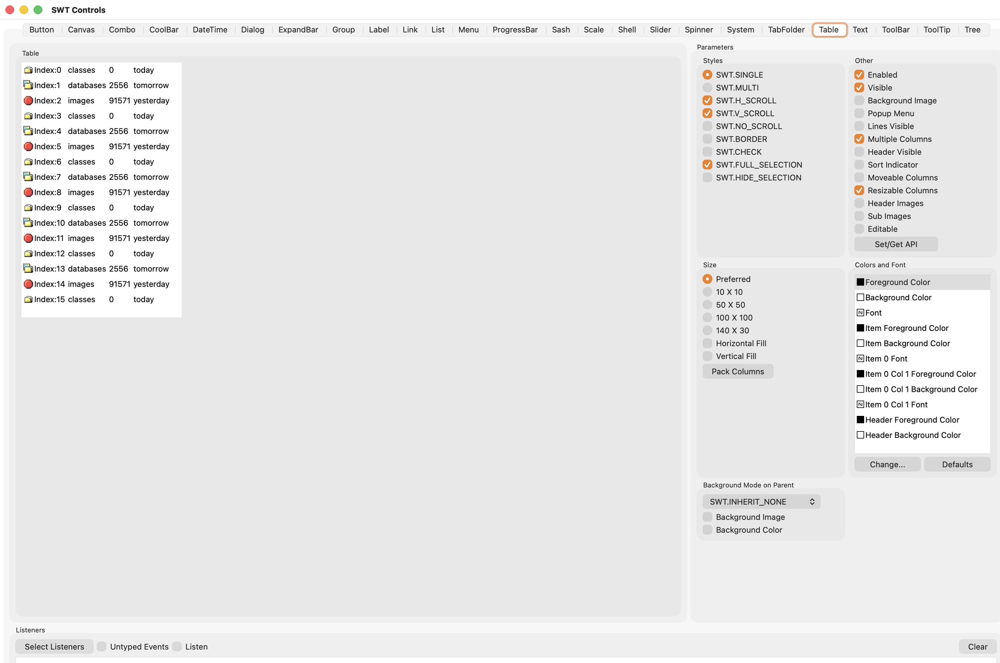
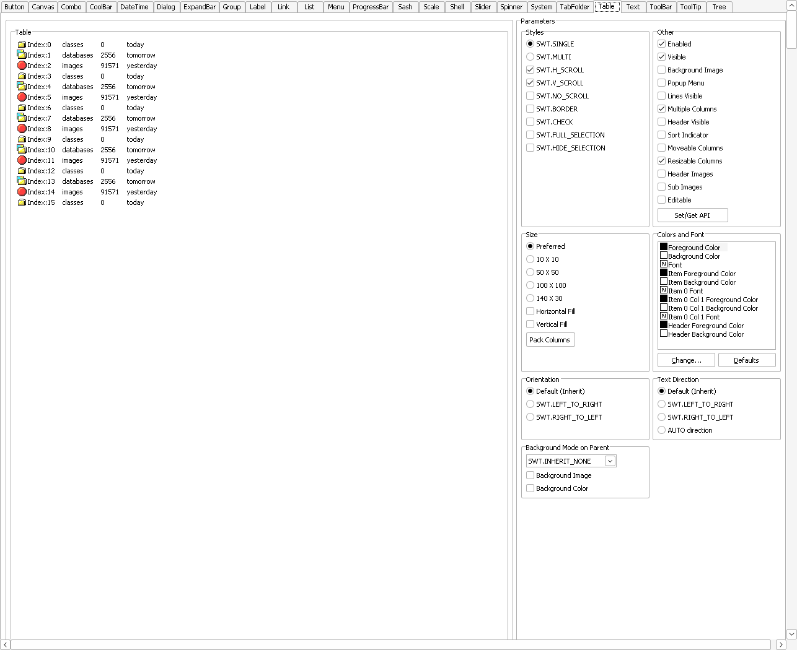
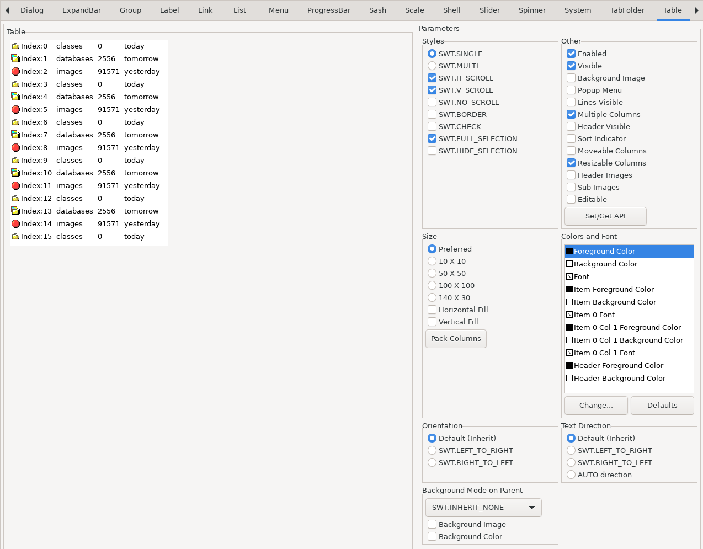

# gowt

Native GUI for Go, without cgo. Windows, tables, menus and dialogs are the operating system's own widgets: AppKit on macOS, Win32 on Windows, GTK 3 on Linux. The API is a small idiomatic Go layer (`gowt`) over Eclipse SWT, which is translated from Java to Go and bound to the OS libraries at run time.

| macOS | Windows | Linux |
|---|---|---|
|  |  |  |

The pictures above are the regression references of SWT's ControlExample (Table tab) taken by `make snap-update` on each OS (the Windows one under Wine, the Linux one in Docker with Xvfb). They show the translated SWT layer, not a program written with the `gowt` facade.

<!-- SCREENSHOTS (facade demo, to be taken with the user's consent; run each, wait 3-4 s, then capture):
macOS:   go build -o bin/gowtdemo ./cmd/gowtdemo && ./bin/gowtdemo &   then   screencapture -o -w docs/img/gowtdemo-macos.png   (click the window)
Windows: GOOS=windows go build -o bin/windows/gowtdemo.exe ./cmd/gowtdemo && /Applications/CrossOver.app/Contents/SharedSupport/CrossOver/bin/wine --bottle gowt $PWD/bin/windows/gowtdemo.exe &   then   screencapture -o -w docs/img/gowtdemo-windows.png
Linux:   make linux-run CMD='cd /src && go build -o /tmp/gowtdemo ./cmd/gowtdemo && (/tmp/gowtdemo & sleep 4; scrot -u /src/docs/img/gowtdemo-linux.png)'
glass:   go run ./cmd/glassdemo   (macOS 26)   then   screencapture -o -w docs/img/glass-macos.png
The commands were not run; the Windows and Linux ones are untested. -->

## Install

```sh
go get github.com/haiodo/gowt@latest
```

Go 1.27 or newer. No C compiler and no Java. Cross-compiling works from any host: `GOOS=windows go build`. Details and per-OS requirements: [docs/install.md](docs/install.md).

## Hello

```go
package main

import "github.com/haiodo/gowt"

func main() {
	gowt.Run(func(app *gowt.App) {
		w := app.Window("Hello")
		w.SetLayout(gowt.Row{Vertical: true, Margin: 12, Spacing: 8})
		w.Label("Hello, gowt")
		w.Button("Quit", app.Quit)
		w.Show()
	})
}
```

`Run` returns an `error`; [`examples/hello`](examples/hello) is the same program with the check.

## Documentation

Start at [docs/index.md](docs/index.md). Each topic has a page and a runnable program:

| Topic | Page | Example |
|---|---|---|
| Windows and layouts | [windows-layouts](docs/windows-layouts.md) | [layouts](examples/layouts) |
| Widgets | [widgets](docs/widgets.md) | [widgets](examples/widgets) |
| Events and the UI thread | [events](docs/events.md) | [events](examples/events) |
| Dialogs and menus | [dialogs-menus](docs/dialogs-menus.md) | [dialogs](examples/dialogs) |
| Graphics and images | [graphics](docs/graphics.md) | [graphics](examples/graphics) |
| Theme and platform look | [theme-look](docs/theme-look.md) | [theme](examples/theme) |
| Icons | [icons](docs/icons.md) | [icons](examples/icons) |
| Web view and Browser | [webview-browser](docs/webview-browser.md) | [webview](examples/webview), [browser](examples/browser) |
| Using swt directly | [swt-direct](docs/swt-direct.md) | [swtdirect](examples/swtdirect) |

## What you get

- Widgets: labels, buttons, text, combo, list, table, tree, tabs, split, scroll, tool bar, menus, date picker, sliders, canvas, dialogs, tray icon.
- Layouts: `Grid`, `Row`, `Fill`, `Form`, `Stack`.
- The system web view next to native widgets: package `webview`, and SWT's `Browser` on top of it.
- Platform look: Liquid Glass on macOS 26, Mica and Acrylic on Windows 11 22H2 and later (package `look`), light/dark following the system, system icons by name (package `icons`).
- The full SWT API in package `swt` for what the facade does not wrap, and JFace layout and widget factories in `jface`.

## Compared with Wails and Fyne

Only what the pages linked in the table say, as fetched on 2026-10-10 (the wails.io and docs.fyne.io architecture pages returned 403/404 and are not used).

| | gowt | Wails | Fyne |
|---|---|---|---|
| UI is | native OS widgets (SWT translated to Go) | web frontend: "Use any frontend technology you are already familiar with to build your UI"; "Uses native rendering engines - no embedded browser!" ([README](https://raw.githubusercontent.com/wailsapp/wails/master/README.md)) | Go GUI toolkit; how it draws widgets was not checked |
| Build needs a C compiler | no | Linux: "standard gcc build tools plus libgtk3 and libwebkit"; macOS: Xcode command line tools ([installation source](https://raw.githubusercontent.com/wailsapp/wails/master/website/docs/gettingstarted/installation.mdx)) | yes: "a C compiler" ([README](https://raw.githubusercontent.com/fyne-io/fyne/master/README.md), [Quick Start](https://docs.fyne.io/started/quick)) |
| Web view next to native widgets | yes: `webview` package | not compared (not stated in the pages checked) | not stated in the pages checked |
| Cross-compile | `GOOS=windows go build` from any host (checked from a Mac for darwin, windows, linux builds of the examples) | the build guide shows one CI job per OS ([guide source](https://raw.githubusercontent.com/wailsapp/wails/master/website/docs/guides/crossplatform-build.mdx)); it does not say anything about cross-compiling | `fyne-cross`, which needs Docker ([fyne-cross README](https://raw.githubusercontent.com/fyne-io/fyne-cross/develop/README.md): "cross compile ... using docker images") |

Not compared because it could not be confirmed from the documentation: how Fyne draws its widgets, Wails' cross-compile limits, binary sizes, performance. gowt is younger and covers fewer widgets than a mature toolkit; see the known gaps below.

## Tests

SWT's own JUnit tests, translated to Go and run per OS by `make test-swt` against `tests/expected*.txt` (a regression fails the gate):

| OS | pass | fail | skip |
|---|---|---|---|
| macOS | 3492 | 30 (+2 flaky) | 26 |
| Windows (Wine, not real Windows) | 3275 | 232 (209 Browser tests: no WebView2 Runtime in the CrossOver bottle; 23 others) | 43 |
| Linux (Docker, Xvfb) | 3497 | 33 | 20 |

JFace tests: 86 pass on macOS and Windows, 85 on Linux. Counts are the `pass`, `fail`, `flaky` and `skip` lines of the expected files; every non-pass line carries a reason. The facade itself has `go test` examples and an API stability gate (`make api-check`).

## Platform requirements

| OS | Needed |
|---|---|
| macOS | 13 or later |
| Windows | 10 or later (the minimum is not verified); WebView2 Runtime for the `webview` package (preinstalled on Windows 11); import `_ "github.com/haiodo/gowt/winmanifest"` for visual styles and DPI awareness |
| Linux | GTK 3 and an X11 or XWayland display; WebKitGTK 4.1 for `webview` |

## Known gaps

- Windows was never run on real Windows, only under Wine (CrossOver). Mica, Acrylic and WebView2 are unverified; per-monitor DPI changes while running are not handled.
- Linux: GTK 3 only.
- `Browser` does not support the Authentication event; see [docs/webview-browser.md](docs/webview-browser.md) for the rest.
- Clipboard, drag and drop and `StyledText` are not in the tree yet (being integrated separately); `Accessible` is a stub on all three OSes.
- macOS Table and Tree use the cell-based AppKit views.

More: [docs/platforms.md](docs/platforms.md). How the repository and the translator work: [docs/internals.md](docs/internals.md).

License: EPL-2.0, see `LICENSE` and `NOTICE`.
