# Widget catalog

Example: [`examples/catalog`](../examples/catalog). `go run ./examples/catalog` shows every sample in tabs; `go run ./examples/catalog table` opens one.

Every widget is created by its parent (`parent.Label(text)`), see [widgets.md](widgets.md) for options and methods. The pictures are `docs/img/<widget>-<os>.png` with `<os>` one of `macos`, `windows`, `linux`; they are written by `make docs-shots`, `win-docs-shots`, `linux-docs-shots` ([screenshots.md](screenshots.md)). A picture that is not in the repository yet has not been generated for that OS.

| Widget | Constructor | What it is | Linux | macOS | Windows |
|---|---|---|---|---|---|
| Label | `Label(text, opts...)` | static text | 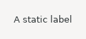 | `img/label-macos.png` | `img/label-windows.png` |
| Button | `Button(text, onClick, opts...)` | push button; `Check()` and `Radio()` make a check box or a radio button | 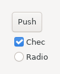 | `img/button-macos.png` | `img/button-windows.png` |
| Text | `Text(opts...)` | edit field; `Multiline()`, `Password()`, `ReadOnly()` | 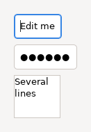 | `img/text-macos.png` | `img/text-windows.png` |
| Link | `Link(html, onClick)` | text with `<a href>` links | 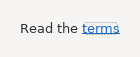 | `img/link-macos.png` | `img/link-windows.png` |
| Combo | `Combo(items, opts...)` | drop-down list, editable unless `ReadOnly()` | 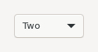 | `img/combo-macos.png` | `img/combo-windows.png` |
| List | `List(items, opts...)` | single or multiple selection list | 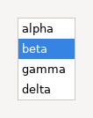 | `img/list-macos.png` | `img/list-windows.png` |
| Table | `Table(opts...)` | rows and columns, `Column`, `Row` | 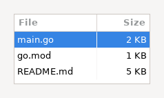 | `img/table-macos.png` | `img/table-windows.png` |
| Tree | `Tree(opts...)` | hierarchy of `Node` | 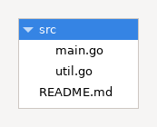 | `img/tree-macos.png` | `img/tree-windows.png` |
| Scale | `Scale(min, max, value, opts...)` | slider with a track | 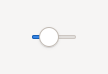 | `img/scale-macos.png` | `img/scale-windows.png` |
| Slider | `Slider(min, max, value, opts...)` | scroll-bar-like value control | 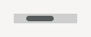 | `img/slider-macos.png` | `img/slider-windows.png` |
| Spinner | `Spinner(min, max, value, opts...)` | number field with arrows | 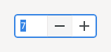 | `img/spinner-macos.png` | `img/spinner-windows.png` |
| Progress | `Progress(max, opts...)` | progress bar; `Smooth()`, `Indeterminate()` | 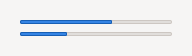 | `img/progress-macos.png` | `img/progress-windows.png` |
| DateTime | `DateTime(opts...)` | date field; `AsTime()`, `AsCalendar()`, `DropDown()` | 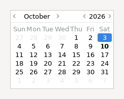 | `img/datetime-macos.png` | `img/datetime-windows.png` |
| Group | `Group(title, opts...)` | titled container | 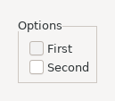 | `img/group-macos.png` | `img/group-windows.png` |
| Panel | `Panel(opts...)` | plain container; `Border()` for a frame | 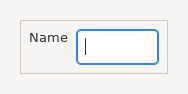 | `img/panel-macos.png` | `img/panel-windows.png` |
| Tabs | `Tabs(opts...)` | native tab folder, `Tab(title)` returns the page | 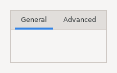 | `img/tabs-macos.png` | `img/tabs-windows.png` |
| CTabs | `CTabs(opts...)` | custom-drawn tabs; `Closable()` | 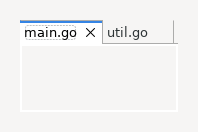 | `img/ctabs-macos.png` | `img/ctabs-windows.png` |
| Split | `Split(opts...)` | children separated by draggable sashes; `SetWeights` | 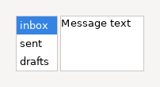 | `img/split-macos.png` | `img/split-windows.png` |
| Scroll | `Scroll(opts...)` | scrollable area; build into `Content()`, then `Fit()` | 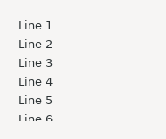 | `img/scroll-macos.png` | `img/scroll-windows.png` |
| ToolBar | `ToolBar(opts...)` | buttons in a row, `Item`, `Separator` | 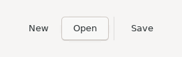 | `img/toolbar-macos.png` | `img/toolbar-windows.png` |
| CoolBar | `CoolBar(opts...)` | draggable bands, `Add(widget)` | 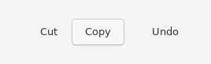 | `img/coolbar-macos.png` | `img/coolbar-windows.png` |
| Sash | `Sash(opts...)` | draggable divider; `OnMove` | 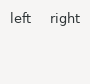 | `img/sash-macos.png` | `img/sash-windows.png` |
| Canvas | `Canvas(onPaint, opts...)` | surface you draw on with a `*GC`, see [graphics.md](graphics.md) | 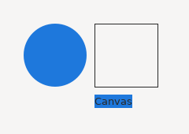 | `img/canvas-macos.png` | `img/canvas-windows.png` |

Outside the table: `Window.MenuBar()` and `PopupMenu` ([dialogs-menus.md](dialogs-menus.md)), `App.Tray`, and the `webview` and `browser` packages ([webview-browser.md](webview-browser.md)). The Sash picture shows two labels: the sash itself is not visible in the Linux picture.
